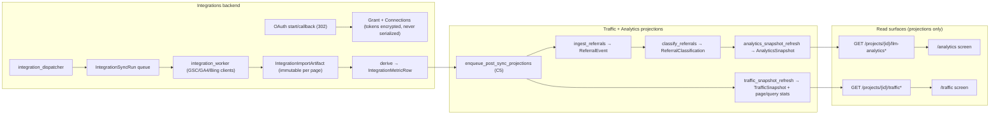

# Summary — v1: First-party data (GSC/GA4/Bing integrations + Traffic + LLM Analytics)

Detailed plan: `/code/.plans/v1-integrations-traffic-analytics.md`. Repo: `/code/abhij1306/Searchify`. Specs: `docs/roadmap/{integrations,traffic,llm-analytics}.md`; all 12 invariants in `docs/invariants.md` apply.

## Goal

Connect first-party search/analytics data (Google Search Console + GA4 on one shared Google OAuth grant, Bing Webmaster on a Microsoft grant), then project it into two read surfaces: a **Traffic** dashboard (`/traffic`) and an **LLM Analytics** dashboard (`/analytics`) that classifies AI referrals and correlates them with visibility. Settings gains a 4th tab, **Integrations** (`?tab=integrations`), as the OAuth callback landing and connection-management UI.

## Scope / non-goals

-   **In:** integrations backend (OAuth, sync pipeline, derivation), Traffic backend + screen, LLM Analytics backend + screen, Settings → Integrations UI.
-   **Out:** S3 payload offload (inline JSONB with a config cap), arbitrary custom `from`/`to` windows (reads serve persisted snapshot windows only), server-log/crawler ingest (Release 1.3), live OAuth E2E (real client credentials wired later), all other roadmap surfaces.
-   Testing is fully mocked (fake OAuth server + `httpx.MockTransport` fixtures); no token may appear in any DTO or log. Migrations stay greenfield: edit models, recreate DB, no new revision files.

## Architecture at a glance

## Workstreams (phase granularity)

**1 — Integrations backend (I1–I12).** Phase 0: config + 8 tables (7 spec tables from integrations.md §3 + added `IntegrationOAuthState` for atomic one-time state consumption); queue spec mirrors `CONTENT_QUEUE_SPEC` claim order (priority desc, available_at asc, randomized_position asc). Phase 1: OAuth connect (extends auth `security.py` state helpers with optional workspace/user/jti claims; auth callers unchanged) + connection management (test / disconnect with shared-grant revoke semantics). Phase 2: sync enqueue (atomic `resync_seq`, active-window partial index), GSC worker (serialized-per-grant token refresh, immutable per-page artifacts), sync/mapping APIs (mapping validated against project `OwnedDomain`s), derivation to `IntegrationMetricRow`, scheduled dispatcher (first recurring scheduler). Phase 3: GA4 (rides the shared Google grant), then Bing.

**2 — Traffic + LLM Analytics backend (A1–A12).** Phase A: config modules, traffic projection models, `AnalyticsTask` queue spine + analytics worker skeleton, deterministic classifier + PII sanitizer (no LLM). Phase B: referral models + ingest projection over GA4 referral-dimension metric rows. Phase C: classify + retention executors, traffic snapshot builder (canonical-identity join to `SiteUrl`), analytics snapshot builder (per-source referrals, visibility series, theme rollup, Pearson correlation with honest `insufficient_data`). Phase D: read APIs serving persisted snapshots only, plus `POST /projects/{id}/traffic/sync` pass-through. Phase E: greenfield recreate + docs.

**3 — Frontend (F1–F10).** Phase A: contract layer per surface (`lib/api/{integrations,traffic,analytics}.ts`, zod `.strict()` — token-leak fails loud, query keys) + `TrendChart` `domainMax` prop, all against msw. Phase B: Settings → Integrations tab (per-grant cards, 302 connect via `assignLocation`, disconnect dialog with shared-grant warning, sync polling). Phase C: `/traffic` shell (dropdown-chip toolbar idiom + segmented-control granularity, sync-now polling) + pages/queries keyset tables (`CursorPager` + `useCursorStack`). Phase D: `/analytics` shell (volume/share trends, source donut, visibility series, correlation card, themes) + referrals drill-down. Phase E: nav/icons/titles + architecture-check owners + docs. Empty states are new domain components in the `VisibilityEmptyState` style. Mockups under `/code/.plans/designs/` are the visual targets.

## Key contracts (pinned before dependent tasks)

-   **C1** GA4 dataset → dimensions/metrics templates + `dimension_key` packing (config-owned by integrations, consumed by analytics). Dataset ids pinned in the contract: `ga4_channel_daily` / `ga4_source_medium_daily` / `ga4_referrer_daily` / `ga4_landing_daily`; multi-dim rows pack values in declared order with `" | "`.
-   **C2** OAuth callback 302 → `/settings?tab=integrations&connected=<provider>` / `&error=<code>`.
-   **C3** `traffic/sync` 202 response `{sync_run_id, connection_id, status}` per queued run; frontend polls the sync-run endpoint.
-   **C4** Keyset `next_cursor` paged envelopes (site-health convention).
-   **C5** Post-sync hook: worker calls `enqueue_post_sync_projections()` → `ingest_referrals` → `classify_referrals` → `analytics_snapshot_refresh`, plus `traffic_snapshot_refresh`.
-   **C6** Backend DTOs are source of truth; frontend reconciles `schemas.ts` per landed API.

## Execution waves

1. I1+I2 · A1+A2+A4 · F1–F4 (msw). 2. I3→I4 · I5 · A3. 3. I6 → I7/I8/I9/I10 · A5 → A6 · A7. 4. I11 → I12 · A8 → A9 · A10 → A11 · F5. 5. F6/F7 · F8/F9 · A12. 6. F10 + full verify + greenfield recreate + seeded local-stack browser pass (`/traffic`, `/analytics`, `/settings?tab=integrations`, incl. `insufficient_data` + empty states) + post-build review vs this plan. Lands as up to three sequential PRs (integrations backend → traffic+analytics backend → frontend), each rebased onto fresh `origin/main`.

## Top risks

-   **R1** C1 GA4 dimension packing is the #1 cross-workstream contract — pin in I1 before A5/A7.
-   **R2** `IntegrationOAuthState` is an 8th table beyond the spec's seven — deliberately kept for atomic one-time consumption.
-   **R3** Bing scope/host literals pinned from Microsoft docs during I12 (mocked tests make it non-blocking).
-   **R4** Three new deployable processes (integration worker/dispatcher, analytics worker); `REFERRAL_HASH_SALT` + OAuth client secrets must be env-set in production.
-   **R5** OAuth 302 through the same-origin proxy must be browser-verified (inv. 12); curl cannot reproduce it.
