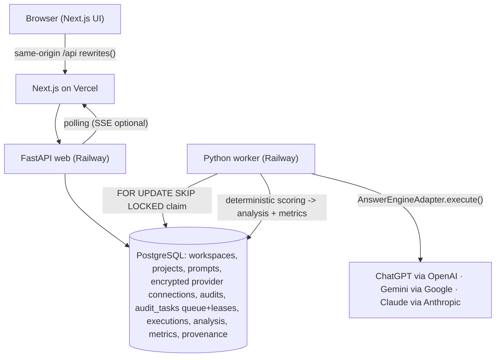
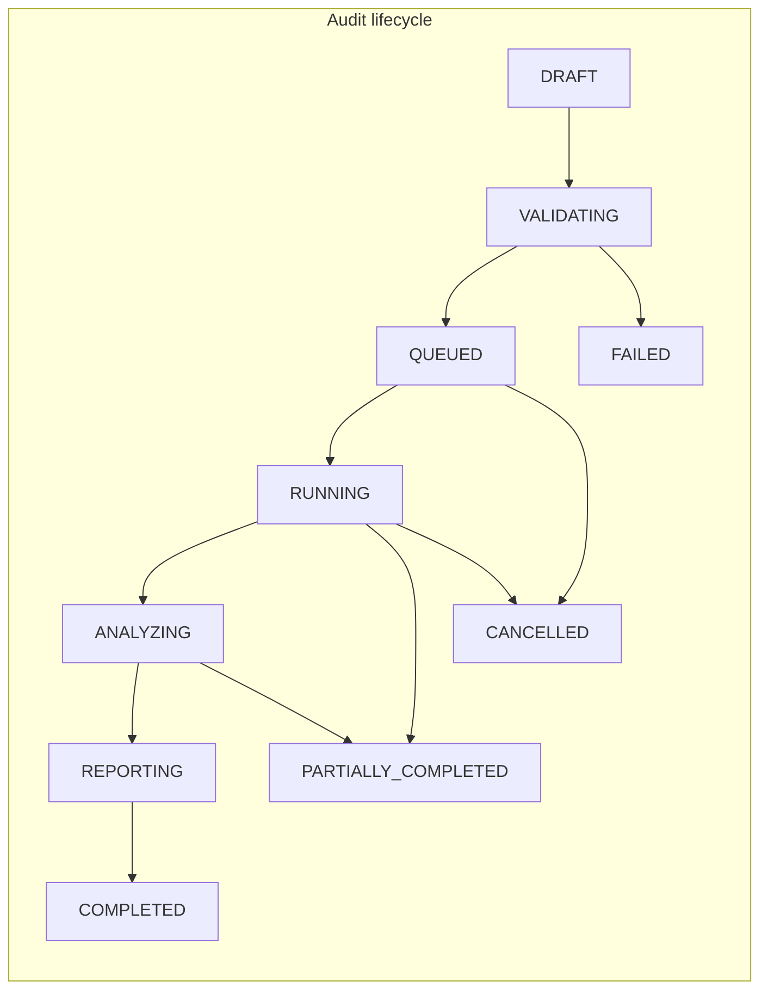

# Searchify — AI-Visibility Product Documentation (Summary)

## Problem & goals
Searchify is a greenfield AEO / AI-visibility SaaS (an original "Searchable"-class product).
The repo is a greenfield monorepo whose architecture is captured in `../architecture.md`. This plan
does two things:

1. **Documentation first** — write repository docs (`Agents.md`, `docs/design.md`,
   `docs/backend-architecture.md`, `docs/frontend-architecture.md`, `docs/invariants.md`) that
   describe the **whole product** (every product surface) with an explicit **MVP-vs-roadmap**
   boundary. `design.md` is a **written design system with concrete token values and per-screen
   layout prose** — complete enough that any build agent can work purely from the written docs.
2. **Code the MVP** — build Searchify's **AI-visibility benchmarking slice** on the **target
   architecture from day one**: workspaces + workspace-scoped auth, **UUID PKs**, BYOK provider
   settings, a Postgres `FOR UPDATE SKIP LOCKED` task queue, and a full audit state machine. It runs
   prompt × engine × repetition executions across three answer engines (ChatGPT/Gemini/Claude), scores
   them deterministically (mentions / citations / visibility metrics), and surfaces results in a
   Visibility dashboard + Run/Executions evidence explorer.

Goal: a runnable, testable, deployable visibility product implementing the visibility slice of the
architecture doc (`../architecture.md` §6–§14) on the architecture the whole product grows into, plus
documentation an agent can build the rest of the product from.

## Subsystem scope (grounded)
- **Implemented as Searchify's own `ai_visibility` domain** (`backend/app/` with `models/`, `schemas/`,
  `api/`, `core/config/ai_visibility.py`, tests): the answer-engine adapters (Gemini grounded working;
  direct Anthropic, OpenAI, and Google transports), the deterministic scoring/normalization/exports, the run-planning +
  deterministic slot shuffle, cooperative cancel, retry/pacing/guardrails.
- **Backend conventions**: FastAPI app-factory + router-per-
  domain; async SQLAlchemy 2.0 typed `Mapped`/`Base`/`get_session`; Fernet `encrypt_secret`/
  `decrypt_secret` + argon2 + joserfc; pydantic-settings singleton; queue-lease fields + dispatcher
  Protocol + state-transition table; Alembic async env; structlog/Logfire; provider catalog +
  `POST /test-connection`. Frontend conventions (typed API client, zod `strictValidate`, Tailwind-v4
  token bridge, CVA primitives, React Query retry policy) are built on
  **Next.js App Router** (Searchify's Vercel target), not Vite.
- **Searchify does NOT include** a crawler/acquisition/browser engine, and never uses integer-PK/
  user-scoped models or a `BackgroundTasks` in-process run loop.

## Architecture at a glance
Modular monolith: FastAPI web + a **separate worker process**, Postgres as durable state **and** task
queue (no Redis in MVP). Monorepo: `frontend/` (Next.js on Vercel) + `backend/` + `migrations/` +
`docs/` + `infra/`. FastAPI + worker + Postgres deploy on Railway. Browser → backend is **same-origin
via Next.js `rewrites()`** (see gotcha 2).

## Key decisions (locked)
| Decision | Rule | Rationale |
|---|---|---|
| Full target architecture from day one | Workspaces + `WorkspaceMember`; **workspace-scoped auth on every query**; **UUID PKs everywhere** | Locked decision #1472 — not a faithful as-is port |
| All three engines | ChatGPT, Gemini, and Claude are measurable through their direct transports (`openai`, `google`, and `anthropic`) | Locked decision #1473 |
| BYOK provider settings | Fernet-encrypted `ProviderConnection`/`ProviderRoute`; `POST /provider-connections/{id}/test`; secret never returned/logged; key resolved from connection, not env | Replaces reference env-only key resolution |
| Postgres is the queue | `FOR UPDATE SKIP LOCKED` + lease + heartbeat + sweeper + idempotency; **`TaskQueue` Protocol** so a Redis swap needs no domain rewrite; no Redis | Locked decision + Redis is roadmap |
| Deterministic slot shuffle + cooperative cancel preserved | Slots shuffled with the run's stored 64-bit seed; worker cancels only at execution boundary | Reproducibility; no zombie/mid-call kills |
| logical vs transport identity | Persist `logical_engine` + `transport_provider` + `transport_model` on every route/attempt (v2 §2.3) | Compare engines; unambiguous provenance |
| Immutable evidence + metrics are projections | Derived rows reference their `RawResponseArtifact` + `analyzer_version`; aggregates read persisted analysis, never re-call providers | Reproducible reports |

## Resolved design questions (previously open — now declared, veto at review)
These were carried as "blocking questions" in the drafts; per the locked full-architecture decisions
they are now **decided**. Any can be vetoed in plan review.
- **B-1 Brand identity = normalized rows** (`Brand`/`BrandAlias`/`Competitor`/`OwnedDomain`/
  `UnintendedDomain`), serialized back to the dict the scorer expects. *Chosen for clean future
  Brand/Competitor/E-E-A-T surfaces on the full architecture; small serialization shim.*
- **B-2 Port reference metrics as-is** (mention/citation/fanout/SOV/stability) into normalized rows;
  **sentiment + average position deferred to roadmap** (documented as not-yet-computed). *Keeps headline
  metrics deterministic and shipped; adding an LLM for headline metrics would break the "no LLM for
  headline metrics" invariant.*
- **B-3 Direct provider routes.** ChatGPT uses OpenAI, Gemini uses Google, and Claude uses Anthropic.
- **B-4 Discovery/analysis model is plumbing-only** (`DiscoveryModelConfig` stored, not invoked);
  AI prompt-suggestion + adjudication are roadmap. *Keeps the visibility loop deterministic.*
- **Frontend Q1–Q4 all resolve to option (A):** backend owns **workspaces + UUIDs**, a
  `/provider-connections` + `/test` BYOK contract, a dedicated **`/prompt-sets`** resource (**MVP CSV
  import** + an AI-generate stub; only AI-generation is roadmap per B-4), and a **dashboard/metrics
  endpoint**. The
  frontend consumes exactly this contract — no int-id / `user_id` fallback.

## One consistent contract (both files agree)
- **All ids are string UUIDs** in backend DTOs and frontend zod schemas — the reference's integer PKs +
  `user_id` scoping are replaced with UUID + workspace scoping.
- **API prefix is `/api/v1`** everywhere (the reference `/api/ai-visibility` prefix is dropped).
- Logical engines are `chatgpt` / `gemini` / `claude`; transports are `openai`, `google`, and
  `anthropic` direct transports.

## MVP vs roadmap boundary (docs describe all; code ships visibility)
- **Coded MVP:** the five doc files (written first); auth + workspaces; projects/brand + prompts
  (manual entry **and** CSV import); BYOK provider settings for the three direct transports; Postgres-queue audit execution + worker + state machine; deterministic analysis
  + metrics; a **single-run/selected-run** Visibility dashboard projection (score + per-engine comparison
  + brand-vs-competitor rankings); Run/Executions API — **backend SSE `/events` endpoint is MVP; the UI
  uses polling first and consumes SSE optionally** — + CSV/Markdown export; the seven
  MVP frontend screens (Auth · App Shell · Brand/Project setup · Prompt library · Provider Settings ·
  Visibility dashboard · Run/Executions explorer).
- **Roadmap (documented, not coded):** **cross-run Visibility trend history** (MVP dashboard is
  single-run projection only, no date/run-range trend), LLM Analytics / AI referrals, Traffic, **AI
  prompt generation** (CSV import IS in MVP; only AI-suggested generation is roadmap), Content,
  Opportunities, **Site Health + Issues (a simple HTTP/Screaming-Frog-style crawler — no browser, and
  no full acquisition engine)**, open-ended Issue catalog, Brand / Competitors / E-E-A-T, Topics,
  GSC/GA4/Bing integrations, Agent, MCP, Settings/white-labelling, HTML/JSON report renderers, S3
  artifacts, Redis queue, sentiment + avg position, discovery-model prompt suggestion + LLM
  adjudication.

## Operational gotchas (must land in invariants + runbook)
1. **Account shell secrets override Docker Compose `${VAR}`.** This machine exports `POSTGRES_PASSWORD`,
   `POSTGRES_USER`, `POSTGRES_DB`, `DATABASE_URL` into every shell; Compose resolves `${VAR}` from the
   shell **before** `.env` (`env_file:` only feeds the container). Workaround:
   `env -u POSTGRES_PASSWORD -u POSTGRES_USER -u POSTGRES_DB -u DATABASE_URL POSTGRES_PASSWORD=<repo-.env-value> docker compose up -d --force-recreate`.
2. **Vorflux tunnel double CORS header.** The preview/tunnel proxy injects its own
   `Access-Control-Allow-Origin: *`; a FastAPI backend that also sets a specific ACAO (needed with
   `allow_credentials=True`) yields two ACAO headers browsers reject. Fix: same-origin proxying via
   Next.js `rewrites()` to the backend on localhost. `curl` cannot reproduce; test in a real browser.

## Documentation
No image/mockup dependency. `design.md` is a written design system with **concrete token values**
(light/dark hex palettes, px type scale, 4px spacing steps, radii, elevation, semantic/status/sentiment/
citation-classification/run-status/score-band colors) and **per-screen layout prose for all seven MVP
screens**, so a build agent can build purely from the written docs. The other four docs cover the whole product
with an MVP/roadmap marker on every surface and both operational gotchas.

## Sequencing
**Documentation is the first task after approval** — task **D1** writes all five doc files before any
backend or frontend implementation begins (implementation tasks depend on D1). Then backend vertical
slices (B1–B6), the frontend screens (F1–F10), and finally an explicit full-stack verification task
(**V1**, `[after B6, F10]`). Full task breakdown, file paths, cross-layer ordering, and per-task tests
are in the implementation plan file.
