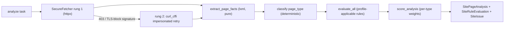
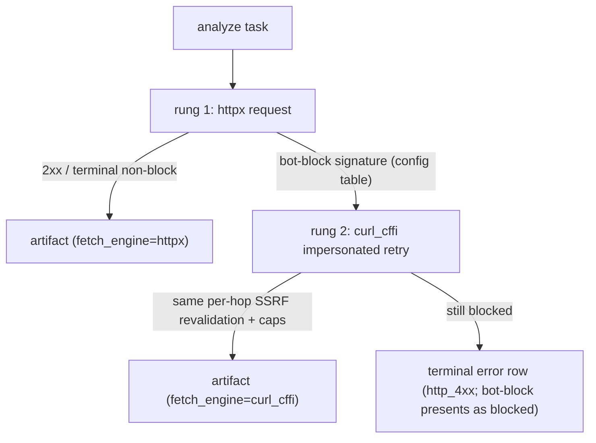

# Roadmap — Site Health v2: page-type-aware analysis + adaptive fetch

> **Status: roadmap / not yet coded.** This is a design spec for the next Site Health
> iteration, written so an engineer (or agent) can start building without re-deriving
> the architecture. The as-shipped v1 contract stays in
> [`../site-health.md`](../site-health.md); the original crawler rationale stays in
> [`technical-audit.md`](technical-audit.md). It follows the same conventions as the
> MVP: UUID PKs, workspace scoping, the Postgres `FOR UPDATE SKIP LOCKED` task queue,
> immutable artifacts, and provenance on every derived row. Read
> [`../../Agents.md`](../../Agents.md) and [`../invariants.md`](../invariants.md) first
> — every rule there applies here too.

## 1. Problem & goals

Site Health v1 treats every URL as the same page. Four concrete gaps:

1. **Page-type-blind rules.** The catalog (`SITE_HEALTH_RULES` in
   `backend/app/core/config/site_health.py`) holds 9 rules applied uniformly to every
   admitted URL; applicability is only `"always" | "has_html"`
   (`backend/app/analysis/site_health/rules.py::_is_applicable`). A homepage, a blog
   article, and a product page are scored against the same checklist, so the report
   cannot say anything type-specific ("product page missing `offers` schema").
2. **Presence-only structured-data validation.**
   `STRUCTURED_DATA_REQUIRED_PROPERTIES` recognizes 7 schema.org types with a minimal
   property map and no page-type expectation — an article page with no `Article`
   markup still passes `aeo.structured_data_present` if *any* recognized type is
   present.
3. **Thin vs competitors.** No AI-crawler robots.txt analysis, no `llms.txt`, no
   citability/extractability signals, no per-type schema validity (§3).
4. **Fetch blind spot.** `SecureFetcher` (httpx) presents a non-browser TLS
   fingerprint. Bot-protected sites answer `403` and the URL lands as an `error` row
   instead of an audit; there is no escalation rung
   (`backend/app/connectors/web_evidence/fetcher.py`).

Goals:

- **G1.** Every analyzed page carries a deterministic `page_type` +
  `classifier_version`, falling back to `other`.
- **G2.** Rule applicability, expected schema.org types, thin-content minimums, and
  rule weights are per page type, all config-owned (invariant 1).
- **G3.** Expanded deterministic AEO catalog: AI-crawler access
  (GPTBot / ClaudeBot / PerplexityBot / Google-Extended), `llms.txt`, per-type schema
  validity, content extractability, citability, sitemap/canonical/hreflang/broken-link
  hygiene.
- **G4.** Fetch escalation — httpx → curl_cffi impersonated retry on bot-block
  signatures — plus an opt-in headless render tier (design only in this spec).
- **G5.** Invariants intact: determinism (9), config-owned everything (1), provenance
  on every derived row (4), Free non-disclosure, no raw-HTML storage.

Non-goals (v2):

- No LLM anywhere in classification or rule detection. LLM-written recommendation copy
  is future work only (§7), walled off exactly like
  [`sentiment-position.md`](sentiment-position.md).
- No proxy rotation, per-host block memory, or Spider-style crawl framework (CrawlerAI
  machinery that does not fit this product — §4).
- No PageSpeed/CrUX field metrics (roadmap+, §7).
- No raw-HTML persistence; a browser-rendered body is parsed in-process exactly like
  today's HTTP bodies.

## 2. Current state (evidence)

| Layer | Today | Owner |
|---|---|---|
| Rule catalog | 9 rules (6 technical, 3 aeo); applicability `"always"` / `"has_html"` only | `backend/app/core/config/site_health.py` `SITE_HEALTH_RULES` |
| Evaluation | Pure `evaluate_all(facts)`; unknown applicability key fail-closed; a raising check → `error` outcome with zero credit; the one heuristic threshold (`MIN_SUFFICIENT_WORDS`) is analysis-owned here, **not** config (moves to config in v2, §5.2) | `backend/app/analysis/site_health/rules.py` |
| Fact extraction | Bounded lxml facts dict (metadata, headings, body, structured data, links, delivery); no author/date/citation fields | `backend/app/analysis/site_health/parser.py` |
| Structured data | JSON-LD + shallow microdata; 7-type required-property map, presence-only | `backend/app/analysis/site_health/structured_data.py` |
| Scoring | Two dimensions 50/50; `dimension = 100·pass/(pass+fail+error)` over applicable evals; missing → `null`, never a fabricated 0 | `backend/app/analysis/site_health/scoring.py` |
| Pipeline | Analyze task: `SecureFetcher` → `extract_page_facts` → `evaluate_all` → `score_analysis` → `SitePageAnalysis` + `SiteRuleEvaluation` + `SiteIssue` (one per fail) | `backend/app/workers/site_health_worker.py` (`_run_analyze` → `_fetch_analyze` → `_write_page_analysis`) |
| Fetch | httpx `AsyncClient`; manual redirects with per-hop `resolve_target` SSRF revalidation, IP pinning, wire/decoded byte caps, redacted header allowlist | `backend/app/connectors/web_evidence/fetcher.py`, `url_policy.py` |
| robots.txt / sitemaps | **Implemented but unwired.** `robots.py` (`RobotsPolicy`, protego-based) and the `FETCH_PURPOSE_ROBOTS` purpose token exist but are referenced only by unit tests — the worker never fetches robots.txt, never enforces it (`ERROR_ROBOTS_DENIED` is never raised), and never fetches sitemaps (`sitemaps.py` likewise). No AI-bot group analysis | `backend/app/connectors/web_evidence/robots.py`, `sitemaps.py` |
| Queue | Postgres `FOR UPDATE SKIP LOCKED`; task kinds `discover` / `analyze` / `link_check` | `SITE_CRAWL_QUEUE_SPEC` in config |

## 3. Competitive gap

Sources: [Profound Agent Analytics](https://tryprofound.com/features/agent-analytics/crawlability),
[Profound changelog — Pages](https://product.tryprofound.com/changelog/profound-aim-pages-and-more),
[Searchable docs](https://docs.searchable.com), [SKYA features](https://skya.one/features),
[Goodie](https://higoodie.com).

| Capability | Searchify today | Profound | Searchable | SKYA | Goodie |
|---|---|---|---|---|---|
| Page-type-aware rules / per-type schema | No — one 9-rule catalog for all URLs | Per-page health in "Pages" (citations + bot activity + health + content quality) | AEO analysis per page | Per-page-type schema + "AEO depth" | Partial (prioritized recommendations) |
| AI-crawler access audit (robots/blocks) | No | Yes — how AI bots crawl, fetchability problems, bot-intent classification | Partial (technical + AEO audit) | Yes — crawlability/indexation for answer engines | Yes — "how AI crawlers experience your site" |
| Rendering / JS-gated content checks | No (HTTP-only) | Yes — rendering issues affecting citability | Not advertised | Partial | Not advertised |
| Prioritized fixes | Static severity + remediation text | Workflows (automated AEO/SEO audits) | Prioritized recommendations + AI Copilot | Impact-ranked fix lists with effort tags; "Fix Now" paste-ready assets; one-click CMS installers | Prioritized optimization recommendations |
| Deterministic, versioned scoring | **Yes** (rule catalog + versions on every row) | Not public | Not public | Not public | Not public |

What to take from this:

- **AI-crawler access is the table-stakes check we lack.** Since
  [Cloudflare made AI-crawler blocking the default for new domains in July 2025](https://www.cloudflare.com/press/press-releases/2025/cloudflare-just-changed-how-ai-crawlers-scrape-the-internet-at-large/)
  ([blog](https://blog.cloudflare.com/content-independence-day-ai-options/)), many
  sites are accidentally invisible to GPTBot/ClaudeBot/PerplexityBot. Detecting that
  from `robots.txt` is cheap, deterministic, and a real differentiator.
- **Per-type schema validation** (like the
  [Rich Results Test](https://search.google.com/test/rich-results) /
  [validator.schema.org](https://validator.schema.org), but AEO-focused) closes the
  "same rules for every URL" gap competitors already market against.
- **Our standing differentiator is determinism**: versioned rules, reproducible
  scores, full provenance. v2 keeps it — every new check below is deterministic.

## 4. Scrapling evaluation & recommendation

[Scrapling](https://github.com/D4Vinci/Scrapling) is a BSD-licensed Python scraping
library: a progressive fetcher stack (`Fetcher`/`AsyncFetcher` → `StealthyFetcher` →
`DynamicFetcher`/`PlayWrightFetcher`), "adaptive elements" (element fingerprints that
survive DOM redesigns), and a `Spider` crawl framework
([deepwiki](https://deepwiki.com/D4Vinci/Scrapling)). Layer by layer:

| Scrapling layer | What it gives | Fit for Searchify |
|---|---|---|
| `Fetcher` / `AsyncFetcher` | curl_cffi TLS/JA3 impersonation, HTTP/3, no JS rendering | **Engine is valuable; the wrapper is not** |
| `StealthyFetcher` | Camoufox-based anti-bot browser (Turnstile-class challenges) | Render-tier candidate; loses to Patchright (below) |
| `DynamicFetcher` / `PlayWrightFetcher` | Full Playwright automation | Heavier than the render tier needs |
| Adaptive elements | Relocates selectors after site redesigns | **Irrelevant** — we audit pages per fetch; we do not track selectors across redesigns |
| `Spider` framework | Concurrent multi-session crawling, pause/resume, proxy rotation | **Conflicts** — the Postgres SKIP LOCKED queue + entitlement + SSRF architecture already owns this |
| Parser | lxml | No gain — `parser.py` already parses lxml directly |

The valuable layer is the engine under `Fetcher`:
[curl_cffi](https://github.com/lexiforest/curl_cffi) (MIT) impersonates browser
TLS/JA3/HTTP2 fingerprints, is HTTP-only (no JS), and per its docs performs on par
with aiohttp/pycurl. Caveats:

- It does **not** pass JS-execution challenges (Cloudflare Turnstile-class) — that is
  what the opt-in render tier (§5.4) is for.
- It has a disclosed redirect-based SSRF advisory
  ([GHSA-qw2m-4pqf-rmpp](https://github.com/advisories/GHSA-qw2m-4pqf-rmpp), fixed in
  `0.15.0`). **Pin `curl-cffi>=0.15.0`** — CrawlerAI's `>=0.14.0,<1` admits the
  vulnerable range and v2 must not copy that pin. Independently, `SecureFetcher`
  already follows redirects manually and re-validates **every hop** through
  `resolve_target`; any adoption must keep hop validation outside the library and
  never let curl_cffi follow redirects itself.

**Recommendations:**

1. **Adopt curl_cffi directly, not via Scrapling's Fetcher.** Scrapling's value
   layers do not fit (adaptive elements n/a, `Spider` conflicts, parser redundant),
   and its `Fetcher` wraps curl_cffi behind its own session/response model that would
   have to be re-plumbed to preserve per-hop SSRF revalidation, IP pinning, byte caps,
   and header redaction. Taking curl_cffi alone is one thin dependency behind our
   existing fetch contract. This matches the in-house precedent: CrawlerAI depends on
   `curl-cffi` directly (`CrawlerAI/backend/pyproject.toml`).
2. **Render-tier tech: Patchright** ([patchright-python](https://github.com/Kaliiiiiiiiii-Vinyzu/patchright-python),
   an undetected Playwright fork) — already battle-tested in the user's own stack
   (CrawlerAI `app/acquisition/`: browser pool, block detection, `patchright` +
   `curl-cffi` dependencies). Scrapling's `StealthyFetcher`/Camoufox is viable but
   introduces a second, Firefox-fork browser stack with no in-house operational
   history.

## 5. Proposed architecture

### 5.1 Page-type classification

New pure module `backend/app/analysis/site_health/page_types.py`:
`classify(final_url, facts) -> PageTypeAssessment(page_type, confidence, signals,
classifier_version)`. No I/O, no ORM, no LLM — same inputs always give the same type
(invariant 9).

Standard taxonomy (config-owned `PAGE_TYPES` in `site_health.py`):
`homepage`, `article`, `product`, `category`, `pricing`, `docs`, `faq`,
`about_contact`, `other`.

Signal sources, evaluated in a fixed priority order (all pattern tables in config):

| Priority | Signal | Examples (config tables) |
|---|---|---|
| 1 | Root path | Empty/`/` path → `homepage` (deterministic special case). Locale roots (`/en/`), `/index.html`, and www-vs-apex variants resolve through a config path-equivalents table (`HOMEPAGE_PATH_EQUIVALENTS`); anything not listed there deliberately falls through to the lower-priority signals |
| 2 | URL path patterns (`PAGE_TYPE_PATH_PATTERNS`, ordered, first match wins) | `/blog/`, `/news/`, `/guides/` → `article`; `/product(s)/`, `/p/`, `/shop/` → `product`; `/category/`, `/collections/` → `category`; `/pricing` → `pricing`; `/docs/`, `/reference/` → `docs`; `/faq`, `/help` → `faq`; `/about`, `/contact` → `about_contact` |
| 3 | Content/heading heuristics | Question-form h2/h3 ratio → `faq`; price tokens + cart markers → `product`; author byline + date → `article` |
| 4 | Structured-data types (`facts["structured_data"]["types"]`) | `Article`/`BlogPosting`/`NewsArticle` → `article`; `Product` → `product`; `FAQPage` → `faq`; `TechArticle` → `docs` |

**Deliberate semantics — URL/content signals outrank structured-data signals on
conflict.** Classification answers "what IS this page" from URL and content
evidence; the schema.org markup is the page's *claim* about itself, and letting the
claim decide the type would make `aeo.schema_expected_for_type` (§5.3) circular — a
page classified BY its schema would trivially pass its own expectation, and the
motivating case (a product page wrongly marked up as `Article`) would classify
`article` and pass. So when signals 1–3 and signal 4 disagree, the URL/content type
wins, the mismatch is exactly what the expectation rule reports, and both the
winning signal and the schema-suggested type are recorded in the evidence
(`classified_by`, `schema_suggested_type`) so the UI can explain it. Residual
limitation, accepted: a page with no URL/content signal is classified BY its schema
(signal 4 is still better than `other`) and then trivially passes the expectation
rule — with no independent evidence there is nothing to contradict, and the other
schema rules (required/recommended properties, content match) still validate it.

Each matched signal contributes a config-owned weight; `confidence` is the sum.
Below the config threshold → `other`. The contributing signals are recorded as
bounded evidence so the classification is explainable in the UI.

**Pipeline slot:** analysis time, inside the worker's `_write_page_analysis`, after
`extract_page_facts` and before `evaluate_all`. No new task kind, no re-fetch. The
worker writes the result **into the facts dict** — `facts["page_type"]` (plus
`facts["page_type_evidence"]`) — before calling `evaluate_all`, so `evaluate_all`
and `_is_applicable` keep their pure `(facts)` signatures and applicability tokens
(§5.2) simply read `facts["page_type"]`. The type is also persisted on the analysis
row (§5.5). `CLASSIFIER_VERSION = "sh-classifier-1"` stamps every row (invariant 4).

### 5.2 Page-type profiles

New config-owned `PAGE_TYPE_PROFILES` in `site_health.py`. Per type:

- **Expected schema map** — extends `STRUCTURED_DATA_REQUIRED_PROPERTIES` into a
  per-type expectation with a required/recommended property split
  (`PAGE_TYPE_EXPECTED_SCHEMA`):

| page_type | Expected types | Required properties | Recommended properties |
|---|---|---|---|
| `homepage` | `Organization`, `WebSite` | `name`, `url` | `sameAs`, `logo` |
| `article` | `Article` (or Blog/News variants) | `headline`, `author`, `datePublished` | `image`, `dateModified` |
| `product` | `Product` | `name`, `offers` | `offers.price`, `offers.priceCurrency`, `aggregateRating` |
| `category` | `BreadcrumbList`, `CollectionPage`/`ItemList` | `itemListElement` | — |
| `pricing` | `Product` or `Service` with `offers` | `offers` | `price`, `priceCurrency` |
| `docs` | `TechArticle` | `headline` | `author`, `dateModified` |
| `faq` | `FAQPage` | `mainEntity` | — |
| `about_contact` | `Organization`/`LocalBusiness`, `ContactPage` | `name` | `contactPoint`, `address` |
| `other` | `WebPage` | `name` | — |

  Validation is Rich-Results-style and deterministic, and it maps onto the existing
  outcome vocabulary (`pass`/`fail`/`not_applicable`/`error`) with **two separate
  rules** — there is no "soft fail" outcome: `aeo.schema_required_valid` fails when
  a required property is missing (normal fail → issue → score), and
  `aeo.schema_recommended_present` (severity `low`, small config weight) fails when
  a recommended property is missing, so the finding flows through the unchanged
  issue/scoring machinery as a low-severity issue instead of needing a new outcome
  kind. Bounded schema-vs-visible-content cross-checks (e.g. `Product.name`
  contained in the `<title>`/h1 text — plain string containment, no LLM).

- **Applicability** — `applicability_key` generalizes: keep `always` / `has_html`,
  add `page_type:<type>` tokens (e.g. `page_type:article`) and the `site_root` /
  `crawl_finalize` scopes (§5.3). `_is_applicable` resolves tokens against
  `facts["page_type"]`; an unknown token stays fail-closed (today's behavior for
  unknown keys).
- **Thin-content minimum** — per-type word minimum. Note this **moves** a threshold:
  today's single global `MIN_SUFFICIENT_WORDS` is analysis-owned in
  `backend/app/analysis/site_health/rules.py` (a deliberate v1 exception, marked in
  a code comment, *not* config); in v2 the per-type minimums live in
  `PAGE_TYPE_PROFILES` (invariant 1) and the analysis constant is removed.
- **Rule weight overrides** — per `(rule_id, page_type)` weight, resolved at
  evaluation time.

**Scoring:** the dimension formula is unchanged
(`100·pass/(pass+fail+error)` over applicable evaluations; missing → `null`). Per-type
behavior enters only through applicability + weights, so `scoring.py` stays the single
formula owner. The crawl rollup gains a per-page-type breakdown in `score_summary`
alongside the existing aggregate; missing/errored URLs still never become zeros.
`SCORING_VERSION` → `sh-scoring-2`.

### 5.3 Expanded rule catalog

All new rules are deterministic, config-owned (thresholds/severities/weights in
`site_health.py`), and bump `RULE_CATALOG_VERSION` → `sh-rules-2`. Grouped below by
dimension + category; the config owns the exact thresholds. Basis: public AEO/GEO
audit checklists ([websiteaiscore](https://websiteaiscore.com/tools/geoauditchecklist),
[webpossible](https://webpossible.com/resources/aeo-geo-audit-checklist),
[201creative](https://201creative.com/geo-audit-checklist-quarterly),
[aeochecker](https://aeochecker.ai)).

| Group | Rules (ids) | Scope | What they check |
|---|---|---|---|
| technical / indexability | `technical.ai_crawler_access` | `site_root` | robots.txt stance toward GPTBot / ClaudeBot / PerplexityBot / Google-Extended (allow vs block, incl. CDN-managed default blocks) |
| technical / indexability | `technical.canonical_conflict` | per-page | canonical vs final-URL mismatch |
| technical / indexability | `technical.sitemap_orphan`, `technical.hreflang_conflict` | `crawl_finalize` | sitemap-vs-crawl orphans (needs the full discovered-vs-sitemap set); hreflang return-tag reciprocity (needs counterpart pages' facts) |
| technical / metadata | `technical.title_length_band`, `technical.meta_description_length_band` | per-page | Length bands complementing today's presence rules |
| technical / links | `technical.broken_internal_link` | `crawl_finalize` | Failed internal targets from the `link_check` task results (which the analyze task itself enqueues, so they cannot exist at per-page time) |
| technical / content | `technical.thin_content` | per-page | Word count below the per-type minimum (§5.2) |
| technical / security | `technical.hsts_present` | per-page | HSTS header (already in delivery facts) |
| technical / performance | `technical.ttfb_band`, `technical.uncompressed_html`, `technical.render_blocking` | per-page | TTFB band, missing gzip/br, blocking-resource count (facts already extracted) |
| aeo / structured_data | `aeo.schema_expected_for_type`, `aeo.schema_matches_content` | per-page | Expected type present for the page type (§5.2, non-circular per §5.1); bounded schema-vs-content cross-check |
| aeo / structured_data | `aeo.schema_required_valid`, `aeo.schema_recommended_present` | per-page | Required properties for the expected type present (normal fail); recommended properties present (severity `low`, small weight — a real fail so it flows through the existing issue/scoring machinery, §5.2) |
| aeo / content | `aeo.answer_first`, `aeo.question_headings`, `aeo.server_rendered_content`, `aeo.no_expand_gating` | per-page | Answer-first structure (first block under the first heading is a definitional/answer sentence — bounded heuristic); question-form h2/h3 presence; key text present in server-rendered HTML (body words vs script-heavy shell); click-to-expand gating ratio |
| aeo / citability (new category) | `aeo.author_present`, `aeo.date_present`, `aeo.outbound_citations`, `aeo.organization_identity` | per-page | Author byline; published/modified dates; outbound links to non-social external domains; `sameAs` on the homepage |
| aeo / site signals | `aeo.llms_txt_present` | `site_root` | `llms.txt` fetch at site root |

**Site-level rules (`site_root` scope) — chosen mechanism: evaluate inside the root
URL's own analysis.** `SiteRuleEvaluation` has non-nullable `analysis_id` +
`source_artifact_id` and is unique per `(analysis_id, rule_id)`, and `SiteIssue` is
strictly a projection of one fail evaluation — so a site-level issue can only exist
anchored to a real per-page analysis. Prerequisite build (P2 scope, not an existing
behavior): **there is no robots.txt fetch at runtime today** — `RobotsPolicy` and
`FETCH_PURPOSE_ROBOTS` are unit-tested but unwired (§2) — so P2 builds the per-host
robots fetch + policy caching in crawl setup, adds the `llms.txt` fetch beside it,
and persists the AI-crawler stance + `llms.txt` result as `site_facts` on the crawl
row (§5.5). (Sitemaps are likewise never fetched at runtime today, so the sitemap
ingestion behind `technical.sitemap_orphan` is P2 build scope too.) When the worker
analyzes the **root URL** (the admitted URL whose normalized form equals the crawl
root), it injects `facts["site"] = {...}` from `site_facts` before `evaluate_all`.
Rules scoped `site_root` are applicable only when `facts["site"]` is present, so
they evaluate exactly once per crawl, inside the root page's analysis, with the root
artifact as `source_artifact_id` — a natural evaluation/issue anchor and no
persistence-model change beyond the display copy of `site_facts`. They disclose no
discovered totals, so Free non-disclosure is untouched.

**Scoring: `site_root` rules carry weight `0` (explicitly excluded from scoring).**
Every evaluation on an analysis feeds `score_analysis`, so a site-wide condition
scored on the root page would drag that page's `technical`/`aeo` denominators for
something that is not a property of its content. Weight 0 (read from the evaluation
row, never entering a numerator or denominator — the same mechanism as
`crawl_finalize`, below) keeps page scores page-scoped; the findings surface as
issues with their config severities and in the dashboard's `site_facts` display.
**If the root URL has no completed analysis** (its fetch failed), the `site_root`
rules are simply **absent** — there is no analysis row to anchor them to and none is
fabricated (identical to how any failed URL contributes nothing today). The raw
`site_facts` display copy is a projection of the crawl row, so the AI-crawler
stance is still visible on the dashboard even when the root analysis failed.

**Cross-page / cross-time rules (`crawl_finalize` scope) — chosen mechanism: a
second evaluation pass in the existing finalize path, with the finalize-writer as
sole owner of those rows.** `evaluate_all(facts)` is pure and per-page, and three
rules cannot be evaluated at per-page time: `technical.broken_internal_link` (the
`link_check` tasks are enqueued *by* the analyze task itself), `technical.sitemap_orphan`
(needs the complete discovered-vs-sitemap set), `technical.hreflang_conflict` (needs
counterpart pages' facts). The design:

- The analyze writer **never persists** evaluations for `crawl_finalize`-scoped
  rules (no placeholder `not_applicable` rows), so the unique
  `(analysis_id, rule_id)` slot stays free for the finalize pass.
- The pass runs as a new step inside `_reconcile_crawl_status` — after analysis
  terminalization and **before** `_persist_snapshot`, under the same crawl
  `FOR UPDATE` lock that already guarantees exactly-once terminalization. It reads
  persisted cross-page evidence (link-check results via `SiteLinkReference` →
  target task/artifact, sitemap-vs-discovered sets via `SiteUrlObservation`,
  hreflang clusters from persisted page facts) and writes one `SiteRuleEvaluation`
  per `(analysis, crawl_finalize rule)` plus one `SiteIssue` per fail. These are
  **new rows, never mutations** (invariant 3); the finalize-writer (the worker
  executing `_reconcile_crawl_status`) is the single owner of `crawl_finalize`-scope
  rows, just as each analyze task owns its per-page rows — so the single-writer rule
  holds per rule scope.
- **Scoring: `crawl_finalize` rules carry weight `0` in v2 config** (weight is read
  from the evaluation row, and weight 0 never enters a numerator or denominator).
  This is the deliberate trade: they produce issues (and land in the snapshot's
  severity/category rollups, because the pass runs before `_persist_snapshot`)
  without recomputing or mutating already-persisted `SitePageAnalysis` scores — the
  analysis row is unique per `artifact_id`, so a post-hoc score change would mean
  either mutating a completed row or an impossible second analysis for the same
  artifact. If scored cross-page rules are ever wanted, that is a separate spec with
  its own score-recompute design.
- On a **cancelled** crawl the finalize pass does not run (tasks never all drain);
  the snapshot path shared with `service.cancel_crawl` then simply has no
  `crawl_finalize` evaluations — their absence fabricates nothing, same as any
  missing row today.

### 5.4 Fetch layer v2

Modelled on CrawlerAI's proven acquisition pattern (`CrawlerAI/backend/app/acquisition/`:
`policy.py` `AcquisitionPolicy`, `planner.py`/`executor.py`, and `VALID_FETCH_MODES` in
`app/core/config/runtime_settings.py`) — but far smaller: no proxies, no
`host_protection_memory` domain memory, no platform policies. v2 escalation is
stateless per task.

- **Fetch-mode vocabulary (config-owned, frozen into `SiteCrawl.configuration`):**
  `auto | http_only | browser_only | http_then_browser` (mirrors CrawlerAI's
  `VALID_FETCH_MODES`). In v2: `http_only` = rung 1 only; `auto` = rung 1 +
  impersonated retry (the default); `browser_only` / `http_then_browser` are reserved
  and activate with the render tier (P4).
- **Escalation inside `SecureFetcher`:** rung 1 is today's httpx path. On a bot-block
  signature — config-owned table of statuses (`401/403/503`) + response markers
  (e.g. Cloudflare challenge markers) and TLS-layer blocks — rung 2 retries once with
  a curl_cffi `AsyncSession` using a config-owned impersonate target
  (`SITE_HEALTH_CURL_IMPERSONATE_TARGET`, e.g. `chrome131`). Escalation happens inside
  the single fetch call; it consumes no extra queue attempt and changes no queue
  semantics.
- **Preserved on rung 2 (non-negotiable):** manual redirects with per-hop
  `resolve_target` revalidation (GHSA-qw2m-4pqf-rmpp), pinned-IP dial, wire/decoded
  byte caps, `PERSISTED_RESPONSE_HEADERS` redaction, per-host politeness (already
  wired: per-host semaphore + fixed delay), no env proxy trust. Robots compliance is
  **added, not preserved** — there is no robots fetch today (§2); P2 adds it on rung
  1 and rung 2 honors the identical per-host policy.
- **Presentation semantics (deliberate change):** today a terminal 4xx presents as
  `error` and `blocked` is reserved for `POLICY_BLOCKING_ERROR_CODES`
  (robots/SSRF). In v2 a signature-detected bot block (both rungs exhausted) joins
  that config set, so the URL presents as `blocked` with its error code rather than
  a generic `error`.
- **Pinned-IP dial is an open implementation risk — P3 starts with a validation
  spike.** The httpx rung pins the validated IP at the transport while preserving
  Host + TLS SNI; curl_cffi needs the `CURLOPT_RESOLVE`-equivalent to do the same.
  The spike must prove that mechanism (dial the validated IP, keep original
  Host/SNI, no re-resolution) before any rung-2 code lands. If curl_cffi cannot pin,
  the documented fallback is re-resolve-and-compare immediately before the request
  (resolve the host again and require the result to match the already-validated IP
  set, closing the DNS-rebinding window to the dial itself) — "pinned-IP dial" stays
  non-negotiable in principle; only the mechanism is spike-dependent.
- **Provenance:** `fetch_engine` (`httpx` | `curl_cffi` | `browser`) recorded on
  `SiteFetchAttempt` and `SiteFetchArtifact` (§5.5).
- **Opt-in headless render tier (design only — P4):** new `TASK_KIND_RENDER` task
  kind; per-URL opt-in on monitored URLs; entitlement-gated (`render_enabled` on the
  capability profile — Free: off) and rate-limited (own concurrency cap + per-crawl
  render budget, both config-owned); Patchright pool per §4. Rendered HTML goes
  through the **same** `extract_page_facts` → rules → scoring path, so determinism
  and Free non-disclosure are preserved; the render persists as a **new** immutable
  artifact generation (invariant 3), never overwriting the HTTP artifact, and the
  analysis row references exactly the artifact it was computed from (invariant 4).

**Guardrail amendment (explicit, ships with P4):** the `docs/site-health.md`
guardrail "no headless browser" becomes "**HTTP-first; browser render is opt-in per
crawl**". `technical-audit.md` §2 already anticipated an opt-in render fallback; this
is a deliberate invariant-doc change and must be called out in the P4 PR description.

### 5.5 Data model & provenance

Greenfield policy (Agents.md): edit the models and recreate the DB — **no new alembic
revision files**, no backfill; old rows keep their old versions.

- `SitePageAnalysis`: + `page_type` (`String(24)`, default `"other"`),
  + `classifier_version` (`String(32)`).
- `SiteFetchAttempt` / `SiteFetchArtifact`: + `fetch_engine` (`String(16)`, default
  `"httpx"`).
- `SiteCrawl`: + `site_facts` (JSONB, nullable) — AI-crawler robots stance and
  `llms.txt` result, written once by the per-host robots + `llms.txt` fetch built in
  P2 (§5.3 — no such runtime fetch exists today).
  It is both the dashboard display copy and the injection source for the
  `site_root`-scoped rules (§5.3); the evaluation/issue rows themselves anchor on
  the root URL's analysis, not on this column.
- Parser facts (`_empty_facts` + extractors): + `author`, `dates`
  (published/modified), `outbound_domains` (bounded), `landmarks`
  (main/article/nav presence), `question_heading_ratio`, `expand_gated_ratio`,
  `hreflang_alternates` (bounded — feeds the `crawl_finalize` hreflang check,
  §5.3) — all bounded like today's fields.
- Version constants (end state; each is bumped by exactly one phase — allocated in
  §6): `EXTRACTOR_VERSION` → `sh-extractor-2`, `ANALYZER_VERSION` → `sh-analyzer-2`,
  `RULE_CATALOG_VERSION` → `sh-rules-2`, `SCORING_VERSION` → `sh-scoring-2`, plus
  new `CLASSIFIER_VERSION = "sh-classifier-1"`.

### 5.6 API & frontend surface

Kept brief — no UI redesign in this spec (mockups 708–713 stay canonical).

- Page rows + per-URL detail DTOs gain `page_type` (badge); the pages/inventory/issues
  list endpoints accept a `page_type` filter. All remain projections of persisted rows
  (invariant 7), workspace-scoped as today (invariant 5).
- Dashboard `score_summary` gains a `by_page_type` breakdown (type → analyzed count +
  mean technical/aeo/overall).
- **Dimensions stay `technical` / `aeo` — no third "AI-readiness" dimension.** The
  50/50 two-dimension contract is wired through DTOs, score rings, exports, and the
  phase machine; the new checks are definitionally AEO concerns and slot into the
  `aeo` dimension at a fraction of the contract cost. If a third dimension is ever
  wanted it gets its own spec.
- Exports: same three views, + a `page_type` column; shape and auth otherwise
  unchanged.

## 6. Phasing / migration path

P1 and P3 are independent; P2 builds on P1; P4 builds on P3. Each phase ships on its
own, recreates the (greenfield) DB, and adds focused tests in the existing
frameworks (unit for the pure modules, component for worker/API). Version bumps are
allocated so **each version is bumped by exactly one phase** (no double-bump):

| Phase | Scope | Depends on | Version bumps |
|---|---|---|---|
| **P1 — classification + profiles** | `page_types.py`, config tables (`PAGE_TYPES`, pattern/equivalence tables, `PAGE_TYPE_PROFILES` applicability + thin-content minimums + weight overrides), `facts["page_type"]` injection, model columns, DTO badges/filters. The per-type **expected-schema map is NOT here** — it ships with its consuming rules in P2, so no dormant config lands | — | New `CLASSIFIER_VERSION = "sh-classifier-1"`; `ANALYZER_VERSION` → `sh-analyzer-2`; `SCORING_VERSION` → `sh-scoring-2`. `RULE_CATALOG_VERSION` stays `sh-rules-1` (no rule-set change); `EXTRACTOR_VERSION` stays (the worker injects `page_type`; the extractor is unchanged) |
| **P2 — expanded rules + site/fetch foundations** | Build the per-host robots fetch + policy caching and the `llms.txt` fetch in crawl setup (none exist at runtime today, §2) + sitemap ingestion; `site_facts` on the crawl; `facts["site"]` injection; the per-type expected-schema map; all new per-page rules (citability, extractability, hygiene, metadata bands, the two schema-property rules); the `crawl_finalize` pass in `_reconcile_crawl_status` | P1 (type-scoped rules + profiles) | `RULE_CATALOG_VERSION` → `sh-rules-2`; `EXTRACTOR_VERSION` → `sh-extractor-2` (new fact fields incl. `hreflang_alternates`). `ANALYZER_VERSION` stays `sh-analyzer-2` (bumped once, in P1) |
| **P3 — curl_cffi escalation** | **Starts with the pinned-IP validation spike** (§5.4); then rung 2 in `SecureFetcher`, fetch-mode vocabulary, `fetch_engine` provenance, bot-block → `blocked` presentation | — (independent of P1/P2) | None (additive `fetch_engine` columns; extraction/rule/scoring logic unchanged) |
| **P4 — opt-in render tier** | `TASK_KIND_RENDER`, Patchright pool, entitlement/config gates, guardrail-doc amendment | P3 (fetch-mode vocabulary), design validation | None (rendered pages go through the same extractor/rules/scoring) |

P1 delivers the core complaint (page-type-aware analysis). P4 is last because it is
the heavyweight piece and carries the invariant-doc amendment.

## 7. Future development notes

Explicitly **not** this spec:

- **LLM-generated recommendations** in the main report / per-URL page. A projection
  layer over deterministic findings — separate versioned rows, never the detector,
  never a headline metric (same wall as
  [`sentiment-position.md`](sentiment-position.md)).
- Sentiment / average position — already spec'd in `sentiment-position.md`.
- PageSpeed/CrUX integration for field Core Web Vitals (deferred in
  `technical-audit.md` §4 and §10).
- Incremental crawls via `If-None-Match` / `If-Modified-Since` (`etag` /
  `last-modified` are already persisted in the redacted header allowlist).
- Per-page-type trend across crawls.

## 8. Guardrails preserved

| Rule | How v2 keeps it |
|---|---|
| Invariant 1 (config-only) | Pattern tables, thresholds, weights, fetch modes, impersonate target, render budgets all live in `app/core/config/site_health.py` |
| Invariant 3 (immutable artifacts) | Render/impersonated retries produce new artifact generations; nothing is overwritten |
| Invariant 4 (provenance) | `page_type` + `classifier_version` + bumped extractor/analyzer/rule/scoring versions on every derived row; `fetch_engine` on every attempt/artifact |
| Invariant 5 (workspace auth) | DTO/filter additions stay behind `require_active_workspace`; foreign ids remain indistinguishable 404s |
| Invariant 7 (projections) | Dashboard per-type breakdown and badges read persisted rows only; the service layer never re-fetches or re-scores |
| Invariant 9 (determinism) | Classifier and all new rules are pure/deterministic; no LLM anywhere in v2 detection; rendered pages go through the same parser + rules + scoring |
| Free non-disclosure | `page_type` and site-level rules leak no discovered/frontier totals; redaction layers unchanged |
| No raw-HTML storage | Rendered bodies are parsed in-process like today's HTTP bodies; only redacted metadata persists |
